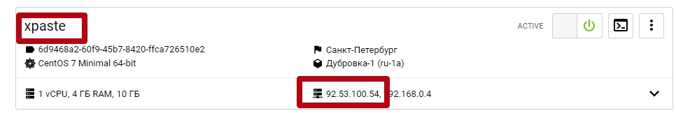

## ci/cd практика

### Ссылки на задания

#### [1. ci/cd c использованием bash](practice/3.ci_cd/01-ci-cd-bash)

#### [2. ci/cd c использованием make](practice/3.ci_cd/02-ci-cd-make)

#### [3. ci/cd c использованием capistrano](practice/3.ci_cd/03-ci-cd-capistrano)

#### SSH setup

Для выполнения практики нам понадобится SSH доступ на:

* sandbox server. 

`Все работы на этом хосте проводятся под учетной записью root`

#### Ссылки

* Xpaste - http://XPASTE_IP

Где XPASTE_IP это IP-адрес сервера xpaste. Для того, чтобы узнать его IP: 
1. Перейдите в личный кабинет по ссылке из письма, раздел `Доступ к личному кабинету Selectel`
2. Выберите нужный регион.
```
 ru-2a Москва Берзарина-1
 ru-2b Москва Берзарина-2
 ru-3a Санкт-Петербург 2
```
3. Посмотрите IP сервера xpaste



#### Репозиторий xpaste

* Делаем форк

Если к моменту прохождения этой практики вы уже сделали форк репозитория xpaste, этот пункт нужно пропустить.

[Переходим по ссылке.](https://gitlab.slurm.io/devops/xpaste) И делаем форк репозитория.

* Клонируем на sandbox форк xpaste

```
cd ~
git clone https://gitlab.slurm.io/<g0000000>/xpaste
```
Обратите внимание, что `<g0000000>` необходимо заменить на свой номер студента.

#### Подготовка переменных окружения

* Подготовка файла окружения

```
cat << EOF >  ~/xpaste/.env
RAILS_ENV=production
SECRET_KEY_BASE=jkdf8xlandfkzz99alldlmernzp2mska7bghqp9akamzja7ejnq65ahjnfj
DB_HOST="127.0.0.1"
DB_NAME="xpaste"
DB_USER="xpaste"
DB_PASSWORD="i0Sp5gZTqW4ZVIyHvDdFgEC0"
HOST=<XPASTE_IP>
EOF
```
В данном файле содержатся переменные, необходимые для деплоя и запуска приложения. Данные переменные вынесены за пределы репозитория, так как содержат чувствительные данные и хранение их совместно с кодом небезопасно.

>
> :question: **Подумайте, как можно автоматизировать процесс создания файла окружения без ущерба безопасности**
>
