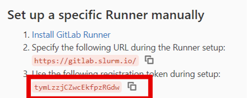
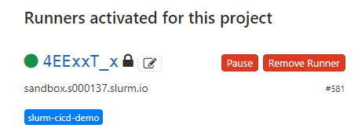

### Установка gitlab-runner

#### Устанавливаем Gitlab runner:

* Добавляем репозиторий

Далее представлен самый простой способ установить репозиторий gitlab, он используется исключительно в учебных целях. На продакшен серверах необходимо внимательно изучить содержание скрипта и добавить проверку контрольной суммы перед его запуском.

```bash
curl -L https://packages.gitlab.com/install/repositories/runner/gitlab-runner/script.rpm.sh | bash
```
* Установка gitlab-runner

Для установки gitlab-runner выполняем команду:

```bash
yum install -y gitlab-runner
```

#### Регистрируем gitlab-runner

* Получаем токен для регистрации gitlab-runner

В браузере переходим в форк проекта xpaste: https://gitlab.slurm.io/g000000/xpaste. Обратите внимание, что `g0000000` необходимо заменить на свой номер студента. Открываем в настройках вкладку CI/CD (`Settings -> CI/CD`) раздел `Runners`. Из этого раздела нам потребуется токен:



* Добавляем gitlab-runner в группу docker

```bash
usermod -a -G docker gitlab-runner
```

* Регистрируем gitlab-runner

Выполним команду на `sandbox`:

```bash
gitlab-runner register
```
В процессе установки будут запрошены данные:

    * `Following URL` - https://gitlab.slurm.io/ 
    * `Registration token`- токен, полученный на прошлом шаге
    * `description`  - оставляем по умолчанию
    * `tag`: slurm-cicd-demo
    * `Executors`: shell

Один gitlab-runner возможно зарегистрировать несколько раз с разным набором параметров.

* Проверка регистрации gitlab-runner

В браузере переходим в форк проекта xpaste: https://gitlab.slurm.io/g000000/xpaste.-/settings/ci_cd. Обратите внимание, что `g0000000` необходимо заменить на свой номер студента. 
В разделе runners должен отображаться ваш runner:



#### Изменения настроек

После установки настройки gitlab-runner могут быть изменены. Для этого необходимо внести изменения в конфигурационный файл: `/etc/gitlab-runner/config.toml`.

В конфигурации gitlab-runner есть одна не очевидная, но очень полезная настройка: глобальная `concurrent` и `limit` на уровне runner. 

* `concurrent` - задает глобальный лимит на количество job, которые могут выполнять все runner.
* `limit` - задает лимит на количество job, которые может выполнять runner.

За счет комбинации этих настроек, например, возможно ограничить количество паралельно запускаемых тяжелых сборок и гарантировать ресурсы для маленьких и легких сборок.

#### Метрики

gitlab-runner имеет встроенную поддержку prometheus. 

* Добаляем экспозицию метрик в конфигурацию gitlab-runner

```bash
sed -i '1 i\listen_address="0.0.0.0:9252"' /etc/gitlab-runner/config.toml
```

Эта команда запишет необходимую настройку в конфигурационный файл gitlab-runner. 

* Применяем настройки для gitlab-runner

```bash
systemctl restart gitlab-runner
```

* Проверяем доступность метрик

Метрики доступны по адресу: http://<SANDBOX_IP>:9252/metrics. Где `SANDBOX_IP` внешний адрес вашего sandbox сервера.


#### Полезные ссылки

Полный список параметров для настройки доступен в [документации](https://docs.gitlab.com/runner/configuration/advanced-configuration.html)
