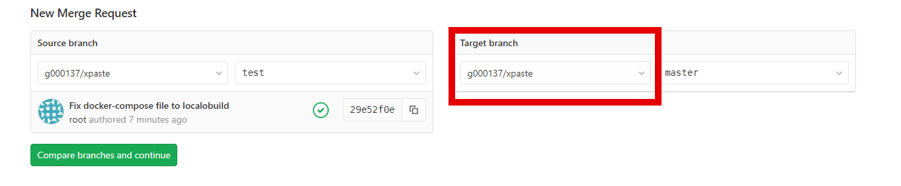
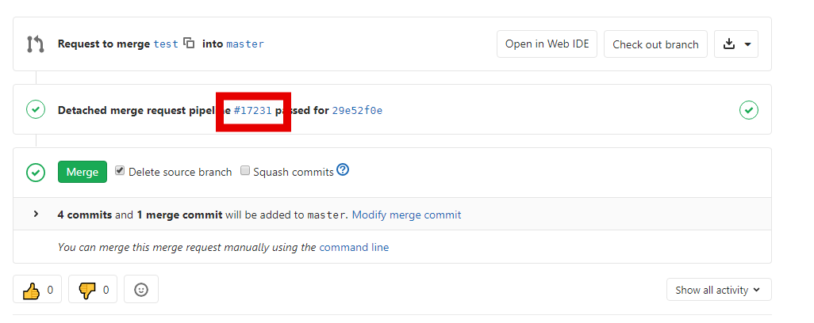

#### Настройка gitlab ci/cd

### Основной конфигурационный файл

gitlab_ci.yml

* `include` - список файлов, которые должны быть включены
* `stages` - список стадий для данного ci/cd
* `variables` - список глобальных переменных
* `jobs` - описание задачи
    * `stage` - стадия, на которой выполняется данная задача
    * `variables` - список локальных переменных
    * `tags` - список тэгов для выбора gitlab-runner
    * `before_script` - скрипт, который выполняется перед стартом задачи
    * `after_script` - скрипт, который выполняется после задачи вне зависимости от результата выполнения задачи
    * `script` - список команд, которые выполняются в данной задаче
    * `only` - ограничения на запуск задачи
    * `when` - выбор способа запуска задачи: автоматический/ручной запуск
    * `allow_failure` - разрешены ли ошибки в результате выполнения данной задачи
    * `artifact` - список артефактов, которые были получены в результате выполнения задачи и должны быть сохранены
    * `cache` - настройки кэша
    * `dependencies` - зависимость от предыдущих стадий; позволяет получать артефакты, собранные на предыдущих стадиях.

### Настройка gitlab ci/cd

* Разрешаем подключение gitlab-runner к серверу

  * Генерируем ключ для gitlab-runner пользователя
  ```bash
  su -l gitlab-runner
  ssh-keygen
  ssh-keygen -R XPASTE_IP
  ```
  где `XPASTE_IP` это IP-адрес сервера xpaste.

  Для продолжения работы необходимо выйти из учетки gitlab-runner.
  
  * Копируем ключ

  ```bash
  ssh-copy-id -i /home/gitlab-runner/.ssh/id_rsa root@XPASTE_IP
  ```

  где `XPASTE_IP` это IP-адрес сервера xpaste.

* Создание Secret Variable

Для деплоя необходимо наличие файла .env. Хранить его вместе с репозиторием небезопасно. Для этого в gitlab есть secret variables. Для создания переменной необходимо перейти в форке проекта xpaste в `Settings -> CI/CD` раздел `Variables`. Создаем переменную: `Type` - file, `Key` - env, `Value`:

  ```bash
  RAILS_ENV=production
  SECRET_KEY_BASE=jkdf8xlandfkzz99alldlmernzp2mska7bghqp9akamzja7ejnq65ahjnfj
  DB_HOST="127.0.0.1"
  DB_NAME="xpaste"
  DB_USER="xpaste"
  DB_PASSWORD="i0Sp5gZTqW4ZVIyHvDdFgEC0"
  HOST=<XPASTE_IP>
  ```
  
  Где `XPASTE_IP` это IP-адрес сервера xpaste.

* Создаем файл gitlab ci/cd
   
  * Создаем новый бранч

  ```bash
  cd ~/xpaste/
  git checkout -b test
  ```

  * Подготавливаем gitlab_ci.yml

  ```yaml
  cat << EOF > ~/xpaste/.gitlab-ci.yml
  stages:
    - test
    - deploy
    - rollback

  Auto test:
    stage: test
    tags: [slurm-cicd-demo]
    script:
      - docker-compose up --abort-on-container-exit --exit-code-from app
    only:
      - merge_requests

  Deploy app to production:
    stage: deploy
    tags: [slurm-cicd-demo]
    script:
      - cat \$env > .env
      - cap production deploy
    only:
      - master

  Rollback app on production:
    stage: rollback
    tags: [slurm-cicd-demo]
    script:
      - cat \$env > .env
      - cap production deploy:rollback
    only:
      - master
    when: manual

  EOF
  ```

  * Пушим изменения

  ```bash
  git add -A
  git commit -am "Add ci for running tests only for merge request"
  git push origin test:test
  ```

  * Создаем Merge request

Переходим на страницу форка проекта xpaste: https://gitlab.slurm.io/GROUP-NAME/xpaste/merge_requests (`GROUP-NAME` необходимо заменить на имя своей группы.) и нажимаем кнопку в правом верхнем углу: `Create merge request`. В качестве `Source branch` выбираем g<номер студента> и ветку test, в `Target branch` выбираем форк нашего репозитория и ветку master.



После этого нажимаем `Compare branches and continue`. Заполняем `Title` и `Description` и нажимаем `Submit`.

В итоге мы получим MR. На данной странице отображаются данные по изменениям в MR, описание данного MR, а также статус pipeline для данного MR.



  * Принимаем MR после окончания тестов

После окончания тестов принимаем MR. Для этого нажимаем кнопку `Merge`.

* Проверка результатов

В результате будет создано два pipeline:

* С тестами приложения, которое запустилось при создании MR.
* Для деплоя приложения. Данный pipeline содержит 2 job:
  * Деплой приложения - запускается автоматически
  * Откат приложения - запускается в ручном режиме

