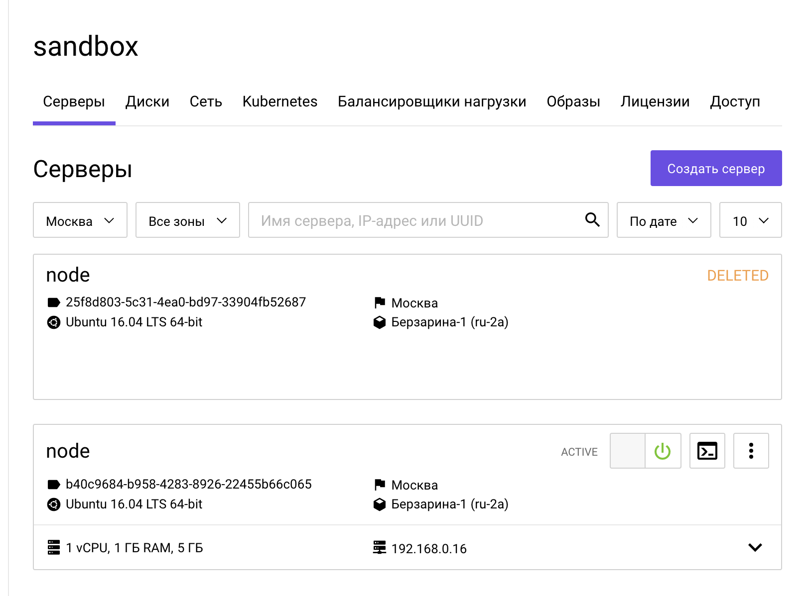

# Terraform первый запуск

*Цель:* создать тестовый сервер через terraform, познакомиться с модулями.

domain_name: 82113

## Подготовка
на `devbox.slurm.io` загрузим репозиторий:
```bash
git clone git@gitlab.slurm.io:devops/devops.git
cd devops/
```

## Создание сервера
Перейдем в каталог practice/5.iac/5.1_Terraform/1.one_server
```bash
cd practice/5.iac/5.1_Terraform/1.one_server
```
Скопируем и заполним sercrets.tfvars.exampale
```bash
cp secrets.tfvars.example secrets.tfvars
```
```bash
vim secrets.tfvars
```
Пример заполнения  
**public_key** - публичный ключ с шел-бокса `cat ~/.ssh/id_rsa.pub`
```bash
domain_name = "DOMAIN_NAME"
project_id = "PROJECT_ID"
user_name = "USER_NAME"
user_password = "USER_PASSWORD"
region = "REGION"
az_zone = "AZ"
volume_type = "fast.ЗОНА"
public_key = "PUBLIC_KEY"
```


Запускаем terraform
```bash
terraform init

terraform plan -var-file=./secrets.tfvars

terraform apply -var-file=./secrets.tfvars
...
Do you want to perform these actions?
  Terraform will perform the actions described above.
  Only 'yes' will be accepted to approve.

  Enter a value: yes <<<<<<<<<<<<<<<<<<<
```

В конце будет вывод переменной `server_external_ip`, содержащий IP-адрес созданного сервера, можно зайти на него по ssh `ssh -l root $(terraform output server_external_ip)`

Так же сервер будет доступен в панели управления.

**Задание для знакомства с терраформом**
* Создайте второй сервер, создав файл `server2.tf`, нужно будет скопировать из main.tf и настроить ресурсы port, volume, instance, и после запустить `terraform apply -var-file=./secrets.tfvars`
* После проверки удалите файл и запустить еще раз `terraform apply -var-file=./secrets.tfvars` для удаление объектов.

Если у вас возниктун сложности, можно свериться с файлом по ссылке https://gist.github.com/f4rx/7704f5663f026fde2feb9668d788d6c4

*Задание:*
* Настройте вывод внутреннего адреса сервера по аналогии с переменной server_external_ip, переменную можно посмотреть в terraform.tfstate (обратите внимание что вывод появится после повторного terraform apply...)
* Параметризуйте значение размера памяти во flavor'e и задайте ему значение по-умолчанию по аналогии с `hdd_size`


Решение доступно по ссылке https://gist.github.com/f4rx/4600e5401fd82bff1cab4b6bf241b169

После параметризации памяти во flavor'е можно обратиться к переменной из shell CLI и отресайзить сервер.
```bash
TF_VAR_ram=2048 terraform apply -var-file=./secrets.tfvars
```

## Модули

Сейчас чтобы добавить второй сервер нужно будет скопировать много ресурсов - порт, вольюм, инстанс. Данные ресурсы можно вынести в отдельный модуль, чтобы переиспользовать.

Перейдем в каталог 2.modules

```bash
cd ../2.modules
```

Создадим каталог `create_server` и манифесты модуля
```bash
mkdir create_server
touch create_server/main.tf create_server/vars.tf create_server/output.tf
```

Перенесем ресурсы:  
`resource "openstack_networking_port_v2" "port_1"`  
`resource "openstack_blockstorage_volume_v3" "volume_1"`  
`resource "openstack_compute_instance_v2" "instance_1"`  
из **2.modules/main.tf** в **2.modules/create_server/main.tf**.  

В **2.modules/main.tf** следует их удалить.

У модуля другая область видимости для переменных, и он может оперировать только с ресурсами, которые сам создает, либо с переменными. Так у нас отсутствует сеть и другие ресурсы и мы должны получать их через аргументы модуля при его вызове. Давайте заполним create_server/vars.tf

```terraform
variable "network_id" {}
variable "subnet_id" {}
variable "hdd_size" {
    default = 5
}
variable "image_id" {}
variable "volume_type" {}
variable "flavor_id" {}
variable "key_pair_id" {}
variable "az_zone" {}
```

Теперь нужно переименовать обращения к этим ресурсам/переменным (файл 2.modules/create_server/main.tf)

```terraform
openstack_networking_network_v2.network_1.id - > var.network_id

openstack_networking_subnet_v2.subnet_1.id -> var.subnet_id

data.openstack_images_image_v2.ubuntu.id -> var.image_id

data.openstack_compute_flavor_v2.flavor_1.id -> var.flavor_id

openstack_compute_keypair_v2.terraform_key.id -> var.key_pair_id
```

В конец файле 2.modules/main.tf можно добавить вызов модуля:
```terraform
module "server_remote_root_disk_1" {
  source = "./create_server"

  network_id = openstack_networking_network_v2.network_1.id
  subnet_id= openstack_networking_subnet_v2.subnet_1.id

  image_id = data.openstack_images_image_v2.ubuntu.id
  volume_type = var.volume_type
  az_zone = var.az_zone
  flavor_id = openstack_compute_flavor_v2.flavor-node.id
  key_pair_id = openstack_compute_keypair_v2.terraform_key.id
}
```

Для упрощения сейчас закомментируем следующие ресурсы, т.к. у нас поменялась область видимости.

В файле 2.modules/main.tf
```terraform
# resource "openstack_networking_floatingip_v2" "floatingip_1" {

# resource "openstack_networking_floatingip_associate_v2" "association_1" {
```  
В 2.modules/outputs.tf:
```terraform
# output "server_external_ip" {
````
После этого можно запустить терраформ в каталоге 2.modules:
```bash
ln -s ../1.one_server/secrets.tfvars .
ln -s ../1.one_server/terraform.tfstate .
terraform init
terraform apply -var-file=./secrets.tfvars
```

Сервер будет пересоздан
```bash
Plan: 4 to add, 0 to change, 6 to destroy.
```

_В случае каких-то проблем можно свериться с https://gist.github.com/f4rx/8c89830338d6f9353e7dc084a7a79814_

Сервер будет пересоздан, т.к. изменятся ресурсы.



Если вызвать модуль из 2.modules/main.tf еще раз, то можно создать второй сервер
```terraform
module "server_remote_root_disk_2" {
  source = "./create_server"

  network_id = openstack_networking_network_v2.network_1.id
  subnet_id= openstack_networking_subnet_v2.subnet_1.id

  image_id = data.openstack_images_image_v2.ubuntu.id
  volume_type = var.volume_type
  az_zone = var.az_zone
  flavor_id = openstack_compute_flavor_v2.flavor-node.id
  key_pair_id = openstack_compute_keypair_v2.terraform_key.id
}
```

Можно удалить отдельно ресурсы модудя через опцию **target**
```bash
terraform destroy -target module.server_remote_root_disk_2 -var-file=./secrets.tfvars
```

**Самостоятельное задание:**

Перед выполнением удалите секцию **module "server_remote_root_disk_2"** из main.tf

* Используя опцию count и модуль create_server, создать два сервера - подробнее https://www.terraform.io/docs/configuration/resources.html#count-multiple-resource-instances-by-count
* Через output переменную выведите внутренний IP-адрес сервера, нужно сделать output переменную внутри модуля, важно - т.к. мы используем несколько ресурсов с count, то в выводе ресурсов будет присутствовать звездочка.
* Модуль может быть удаленным - можно вынести модуль в git-репозиторий (gitlab, github и т.д.) и подключить его с указанием имени бранча или тега - https://www.terraform.io/docs/modules/sources.html#github

Подсказки - https://gist.github.com/f4rx/c135a784ea39ca1a5989838d5ba52a8e

## Подготовка к Packer.

Удалим сервера и другие объекты, т.к. дальше будет использоваться пакер.
```bash
terraform destroy -var-file=./secrets.tfvars
```
