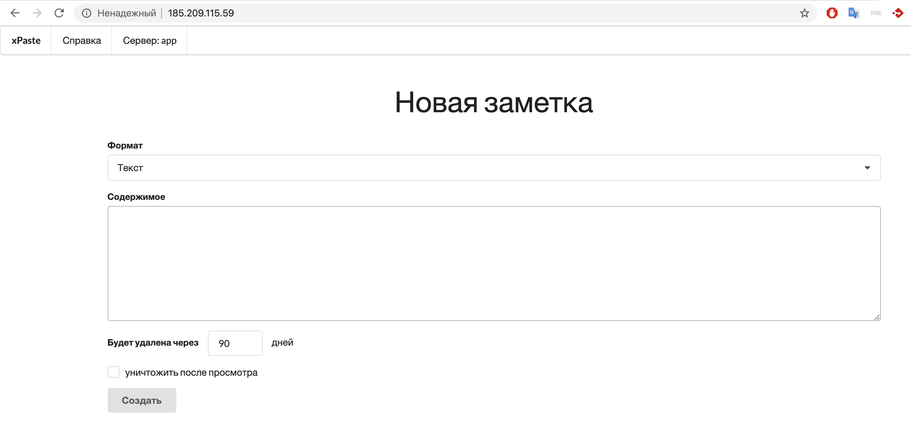

# Packer

**Цель:** "запечь" образ с приложением.

Packer сам создаёт объекты в облачном провайдере, но за исключением сети. Для начала работы нужно создать сеть - самое просто - заказат Floating IP в ПУ:  
1. Заказать 1 Floating IP - панель управления - **Сеть** - **Плавающие IP** - **Добавить IP-адрес** - 1 экземпляр 
1. Теперь перейти на вкладку **Сеть** - **Локальные сети** - скопировать UUID сети nat

Перейдем в каталог `5.2.Packer`, команда ниже представлена от корня репозитория
```bash
cd practice/5.iac/5.2_Packer
```


```bash
cp vars.json.example vars.json
```

```bash
vim vars.json
```

Нужно заполнить следующие поля:
```json
{
  "domain_name": "ДОМЕН",
  "tenant_id": "ПРОЕКТ_ID",
  "username": "ИМЯ_ПОЛЬЗОВАТЕЛЯ",
  "password": "Пароль",
  "networks": "ID_СЕТИ",
  "region": "РЕГИОН",
  "availability_zone": "АЗ",
  "volume_type": "fast.АЗ"
}
```

Запускаем сборку
```bash
packer validate -var-file=vars.json packer.json
packer build -parallel=false -var-file=vars.json packer.json
```

Процесс занимает несколько минут. В это время можно изучить структуру текущего каталога.

В конце будет сообщение:
```bash
==> Builds finished. The artifacts of successful builds are:
--> app: An image was created: ccb4e10e-367c-4ef9-9f0c-8cfd5363a010
--> db: An image was created: 33989ff6-1c19-4072-86af-b85bc69536b1
```

Теперь в панели управления можно создать два сервера db и app для проверки образов.

1. Создать сервер db из образа db-packer, указать при создание IP **192.168.0.100**
1. Создать сервер app из образа centos-app-packer + Floating IP
1. Дождаться создания сервера и перейти по ссылке http://Floating_IP. Если будет сообщение `We're sorry, but something went wrong.` обновить страницу в течение минуты.



В конце данной практики удалить созданные сервера (с дисками) и Floating IP в панели управления.
