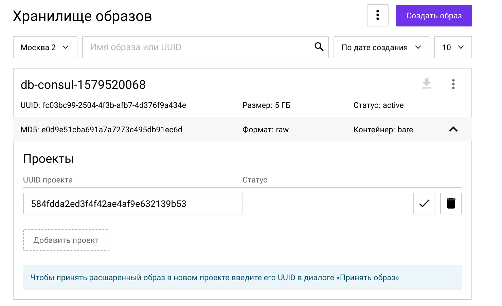
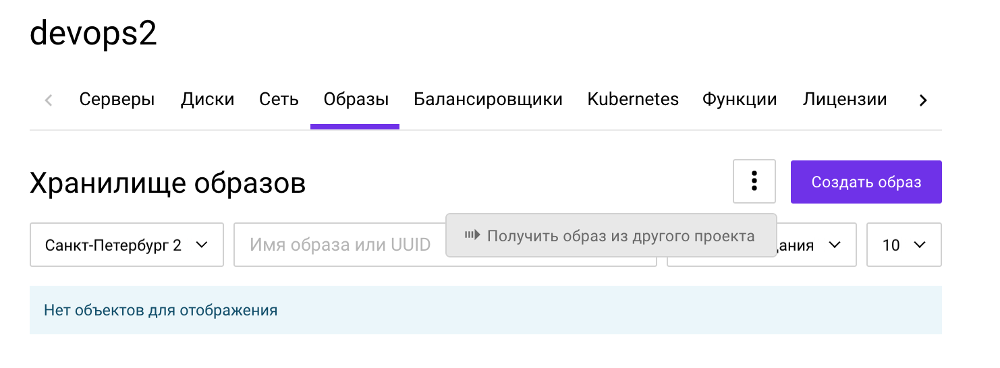
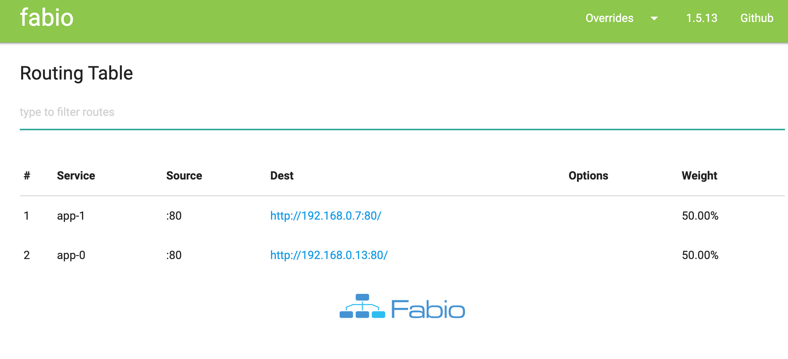

# Создание окружений через Terraform

**Цель:** создать модуль готовой инфраструктуры и развернуть два окружения, при этом количество нод с приложением будет отличаться для продакшена и стейджа/дева.

# Подготовка

Отличие от предыдущей инсталяции - фронтом будет выступать сервис DB с прокси-сервисом Fabio.

Перейдем в каталог `5.5_Terraform` - он будет корневым для этой практики

```bash
cd practice/5.iac/5.5_Terraform/
```

Создадим структуру модуля
```bash
mkdir -p modules/create_env
```

Создадим энвайронменты
```bash
mkdir prod stage
```

Подготовим манифесты, за основу возьмем предыдущий модуль
```bash
cp ../5.4_Terraform/main.tf modules/create_env
cp ../5.4_Terraform/app.tf modules/create_env
cp ../5.4_Terraform/db.tf modules/create_env
cp ../5.4_Terraform/vars.tf modules/create_env
cp ../5.4_Terraform/vars.tf prod
cp ../5.4_Terraform/vars.tf stage
cp ../5.4_Terraform/secrets.tfvars prod
cp ../5.4_Terraform/secrets.tfvars stage

```

в modules/create_env/main.tf удалим блок:
* provider "openstack"

в modules/create_env/app.tf удалим блоки:
* resource "openstack_networking_floatingip_v2" "floatingip_app"
* resource "openstack_networking_floatingip_associate_v2" "association_1"

Добавим внешний адрес на db-ноду в modules/create_env/db.tf
```terraform
###################################
# Create floating IP
###################################
resource "openstack_networking_floatingip_v2" "floatingip_db" {
  pool = "external-network"
}

###################################
# Link floating IP to internal IP
###################################
resource "openstack_networking_floatingip_associate_v2" "association_1" {
  port_id     = openstack_networking_port_v2.port_db.id
  floating_ip = openstack_networking_floatingip_v2.floatingip_db.address
}
```
в секцию `resource "openstack_compute_instance_v2" "db"` в том же файле добавим
```terraform
  provisioner "remote-exec" {
    inline = [
      "docker run -d --name fabio --net=host --restart=unless-stopped fabiolb/fabio -proxy.addr ':80;proto=tcp' -registry.consul.addr 127.0.0.1:8500",
    ]

    connection {
      type = "ssh"
      host  = openstack_networking_floatingip_v2.floatingip_db.address
      user  = "root"
      private_key = file("~/.ssh/id_rsa")
      # agent = true
    }
  }
```

Теперь параметризуем modules/create_env/app.tf для создания нескольких инстансов
```terraform
resource "openstack_networking_port_v2" "port_app" {
  name       = "app-${count.index + 1}-eth0"
  count      = var.app_count
```

```terraform
resource "openstack_blockstorage_volume_v3" "volume_app" {
  name                 = "volume-for-app-server-${count.index + 1}"
  count                = var.app_count
```

Заменим ресурс инстанс
```terraform
resource "openstack_compute_instance_v2" "app" {
  name              = "app-${count.index + 1}"
  count             = var.app_count
  flavor_id         = openstack_compute_flavor_v2.flavor_1.id
  key_pair          = openstack_compute_keypair_v2.terraform_key.id
  availability_zone = var.az_zone

  network {
    port = openstack_networking_port_v2.port_app[count.index].id
  }

  block_device {
    uuid             = openstack_blockstorage_volume_v3.volume_app[count.index].id
    source_type      = "volume"
    destination_type = "volume"
    boot_index       = 0
  }

  vendor_options {
    ignore_resize_confirmation = true
  }

  provisioner "file" {
    content = <<-EOT
      retry_join = ["provider=os tag_key=consul tag_value=server auth_url=https://api.selvpc.ru/identity/v3 password=${var.user_password} user_name=${var.user_name} project_id=${var.project_id}  domain_name=${var.domain_name} region=${var.region}"]

      node_name = "app-${count.index}"

      service = {
        id = "app-${count.index}"
        name = "app-${count.index}"
        port = 80
        tags = ["urlprefix-:80"]
        checks= [{
          id = "check-app"
          http = "http://127.0.0.1"
          interval = "15s"
        }]
      }

    EOT
#"
    destination = "/etc/consul.d/join.hcl"
    connection {
      type  = "ssh"
      // host  = "${openstack_networking_floatingip_v2.floatingip_app.address}"
      host  = self.access_ip_v4
      user  = "root"
      private_key = file("~/.ssh/id_rsa")
      # agent = true
      bastion_host = openstack_networking_floatingip_v2.floatingip_db.address
      bastion_user = "root"
    }
  }

  provisioner "remote-exec" {
    inline = [
      "systemctl restart consul",
    ]

    connection {
      type = "ssh"
      host  = self.access_ip_v4
      user  = "root"
      private_key = file("~/.ssh/id_rsa")
      # agent = true
      bastion_host = openstack_networking_floatingip_v2.floatingip_db.address
      bastion_user = "root"
    }
  }
}
```

в modules/create_env/app.tf и modules/create_env/db.tf для ресурсов `data "openstack_images_image_v2"` заменим visibility на переменную (в дальнейшем будут использоваться shared-образы)
```terraform
visibility  = var.image_visibility_type
```

в modules/create_env/vars.tf добавим параметр для количества app-нод
```terraform
variable "app_count" {
  default = 1
}
variable "image_visibility_type" {
  default = "private"
}
```

В  modules/create_env/db.tf добавим вывод вшенего адреса
```terraform
output "server_external_ip" {
  value = openstack_networking_floatingip_v2.floatingip_db.address
}
```

в 5.5_Terraform/stage/main.tf добавим вызов созданного модуля
```terraform
###################################
# Configure the OpenStack Provider
###################################
provider "openstack" {
  domain_name = var.domain_name
  tenant_id   = var.project_id
  user_name   = var.user_name
  password    = var.user_password
  auth_url    = "https://api.selvpc.ru/identity/v3"
  region      = var.region
}

module "app_stand" {
  source = "../modules/create_env"

  region                = var.region
  public_key            = var.public_key
  hdd_size              = var.hdd_size
  volume_type           = var.volume_type
  az_zone               = var.az_zone

  domain_name = var.domain_name
  project_id = var.project_id
  user_name = var.user_name
  user_password = var.user_password

  image_visibility_type = "shared"
  // app_count             = "2"
}

output "server_external_ip" {
  value = module.app_stand.server_external_ip
}
```

В случае проблем можно свериться с репозиторием https://github.com/f4rx/slurm-5.5-terraform

# Stage

Отредактируем stage секрет и укажем ID stage-проекта
```bash
vim stage/secrets.tfvars
```

Для доступа из двух проектов к одному образу - нужно эти образа "расшарить".  
Для этого зайдем в ПУ в **основной проект** - **Образы** - развернем карточку у **db-consul-...** - в пункте **Проекты** **Добавить проект** укажем UUID второго проекта и подтвердить.  
Сделать тоже самое для образа **app-consul-...**

Запищите UUID'ы этих образов, т.к. дальше будут использованы



После чего перейти во второй проект (stage) для этого удобно открыть второй браузер или инкогнито-окно - **образы** - убедиться, что выбран тот же регион - три точки - получить образ из другого проекта и указать uuid образа для импорта



Т.к. openstack-провайдер берет данные в том числе из OS_ (после работы с rc.sh) переменных можно перезайти на devbox или создать новую сессию `env -i bash`

Создадим stage
```bash
cd stage
terraform init
terraform apply -var-file=./secrets.tfvars
```

Проверим Consul и Fabio в браузере, сервис перейдет в health в течение минуты
```bash
# Consul
echo http://$(terraform output server_external_ip):8500
# Fabio
echo http://$(terraform output server_external_ip):9998/routes
``` 

# Prod

Перейдем в каталог с окружением для прода

```bash
cd ../prod
```

Теперь заполняем **prod окружение** 5.5_Terraform/prod/main.tf добавим вызов созданного модуля
```terraform
###################################
# Configure the OpenStack Provider
###################################
provider "openstack" {
  domain_name = var.domain_name
  tenant_id   = var.project_id
  user_name   = var.user_name
  password    = var.user_password
  auth_url    = "https://api.selvpc.ru/identity/v3"
  region      = var.region
}

module "app_stand" {
  source = "../modules/create_env"

  region                = var.region
  public_key            = var.public_key
  hdd_size              = var.hdd_size
  volume_type           = var.volume_type
  az_zone               = var.az_zone

  domain_name = var.domain_name
  project_id = var.project_id
  user_name = var.user_name
  user_password = var.user_password

  image_visibility_type = "shared"
  app_count             = "2"
}

output "server_external_ip" {
  value = module.app_stand.server_external_ip
}

```

```bash
terraform init
terraform apply -var-file=./secrets.tfvars
```

Проверим Consul и Fabio в браузере
```bash
echo Consul
echo http://$(terraform output server_external_ip):8500
echo Fabio
echo http://$(terraform output server_external_ip):9998/routes
```
и откроем в браузере и проверим в течение минуты


```bash
$ curl -ss http://$(terraform output server_external_ip)/ | grep "item.*app"
      <a class="item" href="">Сервер: app-2
$ curl -ss http://$(terraform output server_external_ip)/ | grep "item.*app"
      <a class="item" href="">Сервер: app-2
$ curl -ss http://$(terraform output server_external_ip)/ | grep "item.*app"
      <a class="item" href="">Сервер: app-1
$ curl -ss http://$(terraform output server_external_ip)/ | grep "item.*app"
      <a class="item" href="">Сервер: app-1
```

Увеличим количество нод, поменяем app_count на 3 в prod/main.tf и запустим
```bash
terraform apply -var-file=./secrets.tfvars
```

Где-то через минуту в Фабио появится новый бекенд

# Вынос модуля в гит


Откроем https://gitlab.slurm.io/projects/new и создадим новый проект `app-stand`

Перейдем в каталог с модулям
```bash
cd ../modules/create_env
```

и загрузим в гитлаб
```bash
git config --global user.email ${USER}
git config --global user.name ${USER}

git init
# git remote add origin https://gitlab.slurm.io/${USER}/app-stand.git
git remote add origin git@gitlab.slurm.io:${USER}/app-stand.git
git add .
git commit -m "Initial commit"
git push -u origin master
```

в prod/main.tf заменим
```terraform
module "app_stand" {
  source = "../modules/create_env"
```
на блок с удаленным git-репозиторием, заменив `USERNAME` на логин пользователя в Gitlab'e
```terraform
module "app_stand" {
  source = "git::ssh://git@gitlab.slurm.io/USERNAME/app-stand.git?ref=master"

```

```bash
terraform init
terraform apply -var-file=./secrets.tfvars
```

# Совместная работа

Данный пример демонстрационный. Продакшн решения следудует отдельно продумывать

зайдем по ssh-на db\proxy хост. Адрес хоста `FLOATING_IP` - переменная из `terraform output`
```bash
ssh FLOATING_IP -l root
```
Запустим базу ПГ
```bash
docker run --name terraform-pg -e POSTGRES_PASSWORD=mysecretpassword -p 6543:5432 -d postgres
```

откроем prod/main.tf и добавим блок, заменив `IP` на server_external_ip из вывода `terraform output`
```bash
terraform {
  backend "pg" {
    conn_str = "postgres://postgres:mysecretpassword@IP:6543/postgres?sslmode=disable"
  }
}
```


Перенесем стейт
```bash
$ terraform init
Initializing modules...

Initializing the backend...
Do you want to copy existing state to the new backend?
  Pre-existing state was found while migrating the previous "local" backend to the
  newly configured "pg" backend. No existing state was found in the newly
  configured "pg" backend. Do you want to copy this state to the new "pg"
  backend? Enter "yes" to copy and "no" to start with an empty state.

  Enter a value: yes
```

Текущий стейт пустой
```bash
$ ls -l terraform.tfstate
-rw-r--r--  1 f3ex  staff  0 13 янв 13:18 terraform.tfstate
```

Просмотреть стейт
```bash
terraform state pull
```

Перед удалением окружения перенесем стейт обратно
```bash
terraform state pull > terraform.tfstate
```
в prod/main.tf
```terraform
terraform {
  backend "local" {}
}
```

Разберем стенд
```bash
terraform destroy -var-file=./secrets.tfvars

cd ../stage/
terraform destroy -var-file=./secrets.tfvars
```

# Заключение

https://gist.github.com/f4rx/18cccac83a8025976919c611b60f112d

Демо с генерацией терраформ манифеста через паппет - https://github.com/f4rx/puppet-generate-terraform-manifests