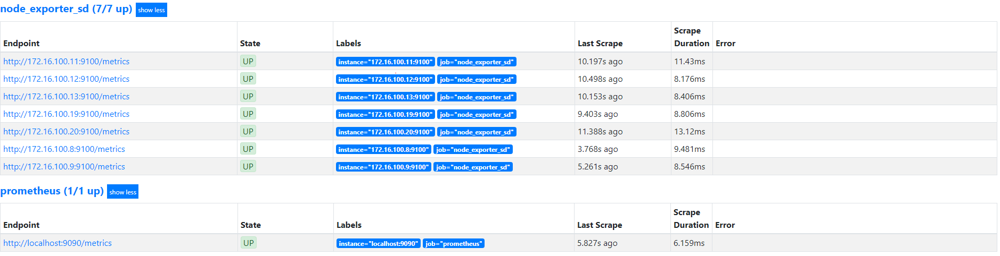
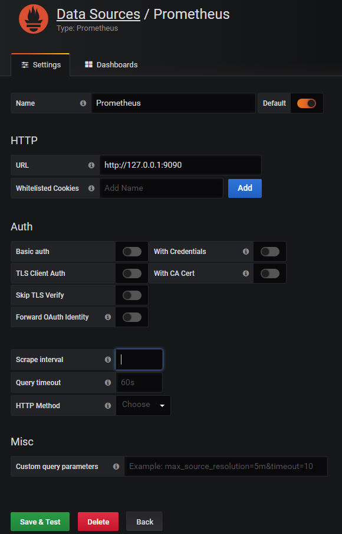

### Базовая настройка Prometheus

`Перед началом практики необходимо отключить Scheduler, который настраивали в практике 5!`

#### Настраиваем service discovery

+ Добавляем service discovery в конфигурационный файл

Prometheus уже установлен на сервере `bastion`. Установлен он с дефолтным конфигурационным файлом. В первую очередь настроим service discovery, для этого заменим конфигурационный файл prometheus: `/etc/prometheus/prometheus.yml` на [новый](configs/prometheus.yml).

В конфигурационном файле необходимо заменить:

```yaml
username: '<user name>' # s00000
project_name: '<Project name>' # project_s00000
password: '<Password>'
region: '<Region>' # ru-3
```

* Применяем изменения
Для применения изменений перезапускаем prometheus

```bash
$ systemctl reload prometheus
```
* Проверка результатов

Открываем в UI Prometheus: `http://<BASTION_IP>:9090/targets`



Некоторые targets будут в состояние DOWN, сбор данных с них будет настроен позже.

* Включаем экспозицию в gitlab-runner

gitlab-runner имеет встроенную поддержку prometheus. 

* Добаляем экспозицию метрик в конфигурацию gitlab-runner

```bash
sed -i '1 i\listen_address="0.0.0.0:9252"' /etc/gitlab-runner/config.toml
```

Эта команда запишет необходимую настройку в конфигурационный файл gitlab-runner. 

* Применяем настройки для gitlab-runner

```bash
systemctl restart gitlab-runner
```

#### Настройка визуализации

+ Создание data source

    * Переходим в UI grafana: `http://<BASTION_IP>:3000`

        Имя пользователя и пароль по умолчанию:
        ```
        user: admin
        password: admin
        ```
        Новый пароль ставим такой же, как и пароль для доступа у учетной записи студента.

    * Добавляем data source Prometheus:

        ```
        URL: http://127.0.0.1:9090
        ```

        Все остальное оставляем по умолчанию и сохраняем

        

        Нажимаем `Test & Save`

+ Создаем dashboard

Нажимаем + слева вверху и выбираем import

Вставляем ID: `1860`

Также импортируем Dashboard c ID: `10156`
