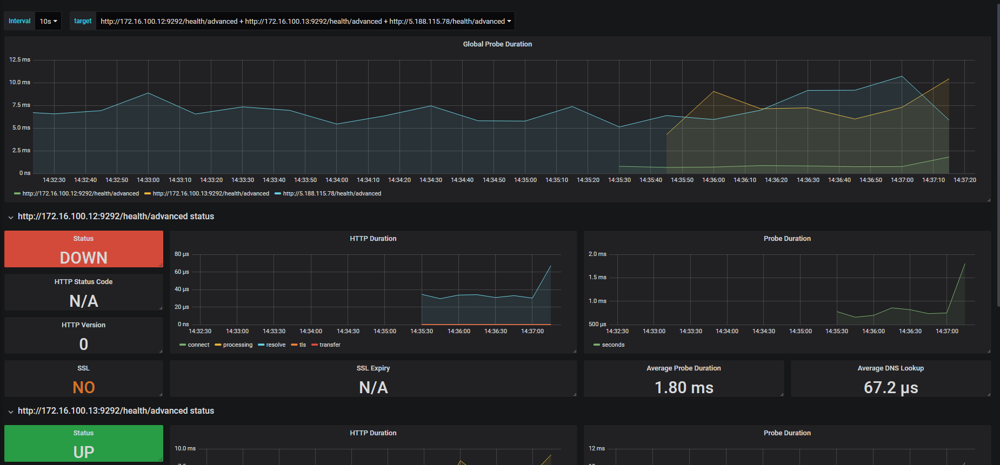
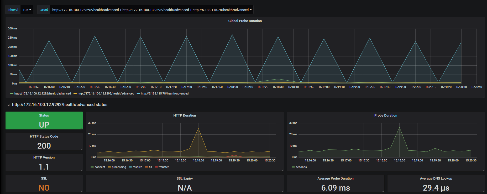
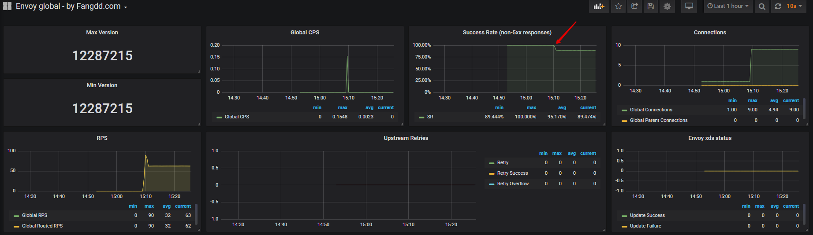
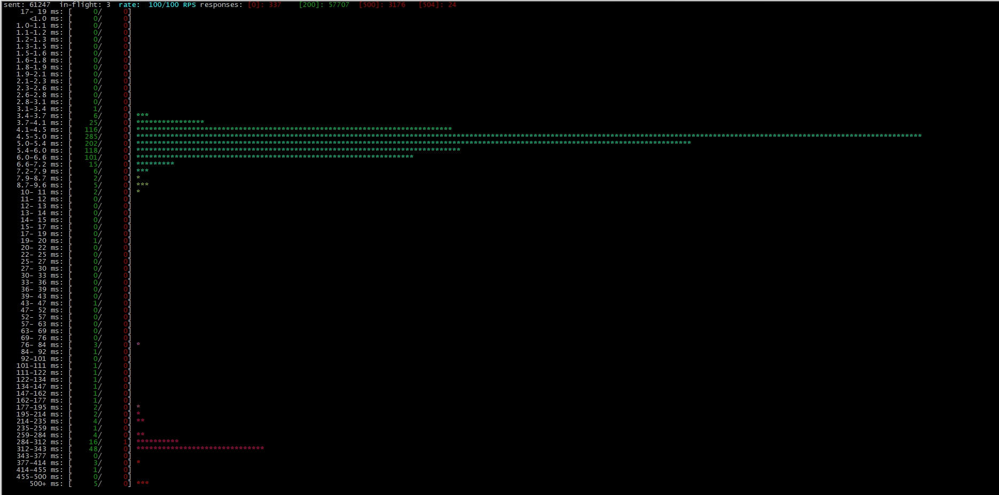
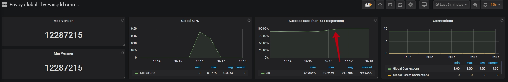

#### Advanced monitoring

#### Настройка мониторинга проекта

* Настройка мониторинга через load balancing

```yaml
  - job_name: blackbox
    metrics_path: /probe
    params:
      module: [http_2xx]
    static_configs:
    - targets:
      - 'http://LB_IP/health/advanced'

    relabel_configs:
      - source_labels: [__address__]
        target_label: __param_target
      - source_labels: [__param_target]
        target_label: instance
      - target_label: __address__
        replacement: localhost:9115 # Blackbox exporter.

```
Для применения настроек необходимо перезапустить Prometheus. Сделаем это, выполнив команду:

```bash
$ promtool check config /etc/prometheus/prometheus.yml 
$ systemctl reload prometheus
```
* Импортируем Dashboard в Grafana

Открываем в браузере: `http://BASTION_IP:3000`. Нажимаем + слева вверху и выбираем import

Вставляем ID: `7587`
Указываем в качестве signcl-prometheus: `Prometheus`


* Отключаем один из aplication servers

```bash
$ ssh puma-1
$ systemctl stop puma@xpaste
```
* Проверяем состояние в Grafana


!!! В результате видим, что приложение доступно, но по факту часть клиентов получают ошибку.

* Добавляем мониторинг application servers

Добавим в раздел targets, в конфигурационном файле `/etc/prometheus/prometheus.yml` для puma сервера. В итоге должно получиться так:
```diff
    - targets:
      - 'http://LB_IP/health/advanced'
+      - 'http://<puma-1_IP>:9292/health/advanced'
+      - 'http://<puma-2_IP>:9292/health/advanced'
```

Для применения настроек необходимо перезапустить Prometheus. Сделаем это, выполнив команду:

```bash
$ promtool check config /etc/prometheus/prometheus.yml 
$ systemctl reload prometheus
```
* Проверяем состояние в Grafana

Вот теперь мы видим, что один из бэкэндов недоступен.



* Включаем обратно application server
```bash
$ ssh devbox.slurm.io
$ ssh puma-1
$ systemctl start puma@xpaste
```

#### Мониторинг с ошибками

##### Подготовка

В этой практике схема выполнения запросов меняется. Если раньше маршрут
запросов был `slapper` -> `nginx-balancer` -> `app`, то сейчас он будет выполняться по
новой схеме `slapper` -> `envoy` -> `nginx-balancer` -> `app`.

Для этого нам понадобятся новые запросы. Сгенерируем их.

```bash
$ ssh devbox.slurm.io
$ ssh bastion

# сдесь LB_IP - это IP-адрес load-balancer, а 127.0.0.1:9921 - это порт на котором работает envoy
$ ./generate-targets-for-slapper.pl --url http://<LB_IP>/paste-file --permalink_alternative_url http://127.0.0.1:9921 > targets-localhost
```

Убедимся, что `envoy` запущен
```bash
$ service envoy status
Redirecting to /bin/systemctl status envoy.service
● envoy.service - envoy
   Loaded: loaded (/etc/systemd/system/envoy.service; enabled; vendor preset: disabled)
   Active: active (running) since Thu 2019-08-29 22:56:21 UTC; 22min ago
  Process: 9070 ExecReload=/usr/bin/kill -HUP $MAINPID (code=exited, status=0/SUCCESS)
 Main PID: 8964 (python)
   CGroup: /system.slice/envoy.service
           ├─8964 python /usr/local/bin/envoy-hot-restarter.py /usr/local/bin/envoy.start.sh
           └─9072 envoy --restart-epoch 0 --config-path /etc/envoy/envoy.yaml --parent-shutdown-time-s 30 --drain-time-s 20
```

Запустим нагрузку через envoy

```bash
# здесь LB_IP - это IP-адрес load-balancer
$ ./slapper -H "Host: <LB_IP>" -targets targets-localhost -maxY 500ms -rate 100
```

Запросы должны успешно выполняться.

### Практика

#### Заставим сервер генерировать ошибки (failure injection)

Переходим на nginx-balancer

```bash
$ ssh devbox.slurm.io
$ ssh nginx-balancer
```
Устанавливаем lua модуль для nginx

```bash
curl -sSO https://rpms.southbridge.ru/rhel8/stable/x86_64/nginx-module-lua-1.17.4.0.10.15-1.el8.ngx.x86_64.rpm
curl -sSO https://rpms.southbridge.ru/rhel8/stable/x86_64/nginx-module-ndk-1.17.4.0.3.1-1.el8.ngx.x86_64.rpm
dnf --disablerepo=AppStream -y update nginx
dnf -y install luajit
rpm -i --nodeps nginx-module-ndk-1.17.4.0.3.1-1.el8.ngx.x86_64.rpm
rpm -i --nodeps nginx-module-lua-1.17.4.0.10.15-1.el8.ngx.x86_64.rpm
reboot
```

Добавим в начало `/etc/nginx/nginx.conf`

```bash
load_module modules/ndk_http_module.so;
load_module modules/ngx_http_lua_module.so;
```

Добавим следующие строки в `/etc/nginx/conf.d/failure-injection.conf`

```
# этот код генерирует 500-ую ошибку с вероятностью в 5%.
# каждая ошибка будет сгенерирована с задержкой в диапазоне от 0 до 1ой секунды.

rewrite_by_lua_block {
  local rand = math.random
  if rand() < 0.05 then
    ngx.sleep(rand())
    return ngx.exit(500)
  end
}
```

Перезагрузим `nginx`

```bash
$ systemctl restart nginx
```

#### Смотрим, что происходит в `slapper` и `grafana`

В `slapper` должно появится некоторое количество 500ых ошибок. Причем их время
ответа остается в рамках около 1 секунды.


в `grafana` эти проблемы не видны:



#### Создаем dashboard envoy с отображением ошибок

Открываем в браузере: `http://BASTION_IP:3000`. Нажимаем + слева сверху и выбираем import

Вставляем ID: `7253`
Указываем в качестве DataSource: `Prometheus`

На графиках видно, процент запросов с **НЕ 50x** статусом



#### Добавим retry для envoy


Раскомментируем следующие строчки в `/etc/envoy/envoy.yaml`

```diff
-                 #timeout: 1s
+                 timeout: 1s
-                 #retry_policy:
+                 retry_policy:
-                    #retry_on: 5xx
+                    retry_on: 5xx
-                    #num_retries: 3
+                    num_retries: 3
-                    #per_try_timeout: 0.3s
+                    per_try_timeout: 0.3s
```

Перезагрузим `envoy`

```bash
$ systemctl reload envoy
Redirecting to /bin/systemctl reload envoy.service
```

Теперь в slapper:



Теперь давайте посмотрим в grafana:




Теперь по графикам видно, что все запросы выполняются без ошибок.
