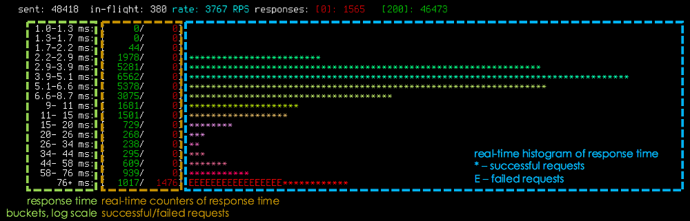

### Мониторинг

### Ссылки на задания

#### [1. Базовая настройка мониторинга](practice/7.monitoring/01-configuration-prom)

#### [2. Тестирование системы мониторинга](practice/7.monitoring/02-unit-test)

#### [3. Advanced monitoring](practice/7.monitoring/03-sre-metrics)

### Общая информация

#### SSH

Для выполнения практики нам понадобится SSH доступ на:

* `bastion`

`Все работы на этом хосте проводятся под учетной записью root`

#### Cсылки

* Prometheus - http://BASTION_IP:9090
* Grafana - http://BASTION_IP:3000

где BASTION_IP это IP-адрес bastion:

```bash
$ ssh devbox.slurm.io
$ ssh bastion
$ curl ifconfig.io
```

#### Инструменты

* [slapper](https://github.com/ikruglov/slapper) - интерактивный load tester
* [generate-targets-for-slapper.pl](generate-targets-for-slapper.pl) - генератор запросов для slapper
* [envoy](https://www.envoyproxy.io/) - service proxy for cloud native applications

### Подготовка

#### Устанавливаем `slapper` и `generate-targets-for-slapper.pl` на bastion.

```bash
$ ssh devbox.slurm.io
$ ssh bastion

# устанавливаем slapper
$ curl -L https://github.com/ikruglov/slapper/releases/download/v0.1.0/slapper-0.1.0-linux-amd64.tar.gz | tar -zxf -
$ ./slapper --help

Usage of ./slapper:
  -H value
    	HTTP header 'key: value' set on all requests. Repeat for more than one header.
  -base64body
    	Bodies in targets file are base64-encoded
  -maxY duration
    	max on Y axe (default 100ms)
  -minY duration
    	min on Y axe (default 0ms)
  -rate uint
    	Requests per second (default 50)
  -targets string
    	Targets file
  -timeout duration
    	Requests timeout (default 30s)
  -workers uint
    	Number of workers (default 8)

# устанавливаем generate-targets-for-slapper.pl
$ curl -o generate-targets-for-slapper.pl https://gitlab.slurm.io/snippets/15/raw
$ chmod +x generate-targets-for-slapper.pl
$ ./generate-targets-for-slapper.pl --help

Usage:
    generate-targets-for-slapper.pl [options]

     Options:
        --url                       URL to target service (example: http://127.0.0.1/paste)
        --count                     number of bodies to generate (default: 10K)
        --pastes_count              number of pastes to create (default: 100)
        --invalid_pcnt              pecentage of invalid bodies to generate (default: 0.0, accepted range: 0..1)
        --max_body_size             maximal size of generated body (default: 1KB)
        --permalink_alternative_url URL which replaces permalink's URL
        --help                      brief help message
```

#### Знакомство с `slapper` и первая тестовая нагрузка

В первую очередь нам нужен IP-адрес load-balancer (ниже по тексту LB_IP). Для этого:

```bash
$ ssh devbox.slurm.io
$ ssh nginx-balancer
$ curl ifconfig.io
```

Далее работаем на bastion.

Генерируем запросы с помощью `generate-targets-for-slapper.pl`
```bash
$ ./generate-targets-for-slapper.pl --url http://LB_IP/paste-file > targets
```

Даем первую нагрузку на `xpaste`
```bash
$ ./slapper -targets targets -maxY 500ms -rate 100
```

#### интерфейс `slapper`



`slapper` hot keys:
* q, ctrl-c - quit
* r - reset stats
* k - increase rate by 100 RPS
* j - decrease rate by 100 RPS

>
> :exclamation: `slapper` не любит изменения размеров терминала. Если изменение необходимо, перезапустите `slapper`.
>

---

>
> :exclamation: Если в `slapper` одни ошибки, то возможно Вы перепутали
> IP-адрес `nginx-balancer` с `bastion` при запуске
> `generate-targets-for-slapper.pl`. Нам нужен IP `nginx-balancer`.
>
